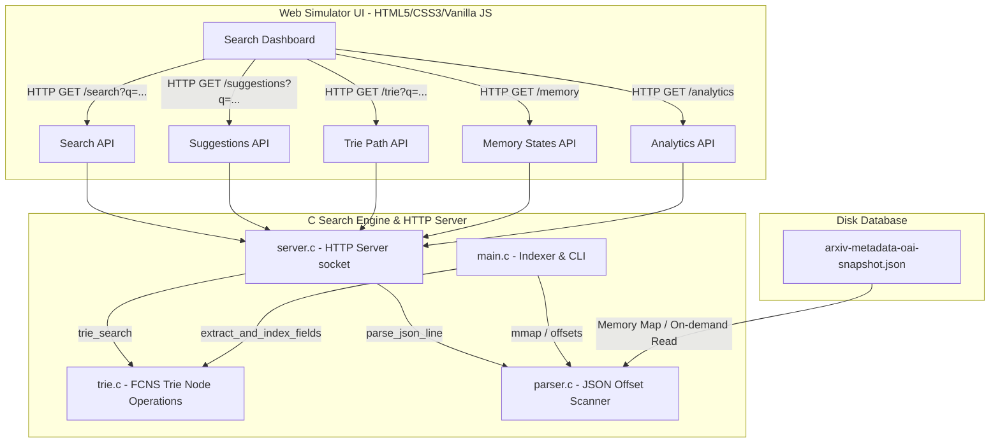

# Research Explorer: Visual Search Engine Internals Simulator

An interactive, high-performance visual simulator of a low-level Trie-based search engine. This project compiles and runs a backend HTTP server in pure C to index over **3 million scientific research papers** (~5 GB arXiv dataset) using a memory-optimized Trie data structure. It visualizes the internal mechanics—such as data flow pipelines, latency breakdowns, physical heap layouts, and active stack frames—on a retro-styled web interface.

---

## 🏗️ System Architecture

The project splits concerns between a highly-optimized C engine on the backend and a visual simulator dashboard in the frontend:



---

## 🧠 Core Data Structure: First-Child Next-Sibling (FCNS) Trie

A standard Trie node contains an array of child pointers for every alphabet character (e.g., `TrieNode* children[26]` or `children[256]`). This consumes **208 bytes** of pointer storage per node on a 64-bit system, which leads to massive memory bloat when indexing millions of words.

To solve this, this engine implements a **First-Child Next-Sibling (FCNS)** tree (a binary representation of a multiway tree). 

### Node Representation (`trie.h`)
```c
typedef struct TrieNode {
    char ch;                        // The character stored in the node
    bool is_word;                   // Flag indicating if this is the end of a valid word
    uint32_t address;               // Simulated memory heap address (e.g., 0x1000 + offset)
    
    struct TrieNode* first_child;   // Pointer to the first child node (downward edge)
    struct TrieNode* next_sibling;  // Pointer to the next sibling node (horizontal list)
    
    int* paper_indices;             // Dynamic array of matching document IDs (Postings List)
    int paper_count;                // Current count of document IDs in the postings list
    int paper_capacity;             // Allocated capacity of the postings list
} TrieNode;
```

### Visualizing FCNS Child Traversal
Instead of a wide array of pointers, siblings are chained sequentially. Finding a character involves traversing the `first_child` and following its `next_sibling` links:

```text
       (ROOT)
         | [first_child]
        ( 'c' ) ---> ( 'd' ) ---> ( 's' )  <-- next_sibling list
         | [first_child]
        ( 'a' )
         | [first_child]
        ( 't' ) <-- is_word = true (Postings: [102, 594, 1205])
```

* **Pros**: Node size drops to a fraction of standard representation (~40 bytes vs 240+ bytes).
* **Cons**: Sibling lookup increases from $O(1)$ to $O(k)$ where $k \le 26$. However, $k$ is extremely small for typical english character sets, resulting in negligible latency trade-offs.

---

## 🛠️ Detailed Walkthrough of Codebase Components

This project is built from scratch in pure C with zero external dependency libraries. Here is a detailed guide explaining the role of each source file:

### 1. Trie Engine Layer (`trie.h` & `trie.c`)
* **Why**: Standard Tries allocate wide arrays of pointers for every alphabet character (e.g. `children[26]` or `children[256]`), which consumes massive amounts of RAM (208+ bytes per node). The **First-Child Next-Sibling (FCNS)** tree structure compresses this to exactly two pointers (`first_child` and `next_sibling`), dropping the memory of a node struct to **40 bytes**.
* **What**: Implements the binary tree nodes, keyword insertions, prefix lookups, and suggestion collectors.
* **How**:
  * [TrieNode](file:///Users/jeevan/Desktop/DSA_Project/trie.h#L11-L26) holds the node character (`ch`), terminal flag (`is_word`), a simulated physical heap memory address (`address`), child/sibling node pointers, and a postings list (`paper_indices`) containing matched document IDs.
  * `create_trie_node()`: Dynamically allocates nodes and generates simulated hex addresses.
  * `trie_insert()`: Traverses the word down the Trie. It walks the `first_child` pointer, then scans the `next_sibling` list. If a character is missing, it dynamically allocates a new node and links it into the sibling chain. Once the end of the word is reached, it appends the paper's ID to the postings list.
  * `trie_search()`: Traverses the sibling chains matching characters sequentially. It logs visited nodes and updates simulated memory heap blocks.
  * `trie_collect_suggestions()`: Collects suggestions by traversing suffixes starting from a matched prefix node using depth-first sibling recursion.

### 2. Zero-Dependency JSON Parser (`parser.h` & `parser.c`)
* **Why**: General-purpose JSON parsing libraries (like cJSON) parse the entire document structure into a complex tree in memory. Doing this for 3 million lines would cause massive CPU overhead and memory fragmentation.
* **What**: Scans the JSON text manually using direct pointers (`strstr`), bypassing full JSON serialization.
* **How**:
  * `extract_field()`: Searches for target key boundaries (e.g. `"title"`, `"authors"`) using pointer matching. It calculates character lengths and extracts strings directly into memory buffers.
  * `parse_json_line()`: Parses the raw JSON lines, allocating the `PaperMetadata` structure, extracting fields, and unescaping special characters.
  * `unescape_string()`: Scans in-place to translate JSON double-escapes (like `\n`, `\t`, `\"`) back to their raw ASCII forms.

### 3. C TCP Socket Server (`server.h` & `server.c`)
* **Why**: Building a low-level HTTP server teaches network concepts like raw TCP stream parsing, connection states, options handshakes, and CORS mechanisms without web frameworks.
* **What**: Binds to a TCP port, listens for incoming request packets, routes URL paths, and responds with JSON data or static frontend files.
* **How**:
  * `start_server()`: Standard socket flow: calls `socket()`, sets `SO_REUSEADDR` to recycle ports, maps `bind()`, and listens for TCP client connections.
  * HTTP Loop: Calls `accept()` to establish a connection, reads HTTP header buffers, extracts the request URL path, and routes it to specific handlers:
    * `/` or `/index.html`: Streams the UI page.
    * `/search`: Collects search parameters, tokenizes multi-word queries, intersects postings lists (`intersect_postings`), parses the JSON text of matching document offsets, sorts the final matching array, and builds the JSON string response.
    * `/suggestions`: Returns auto-complete candidate words.
    * `/memory`, `/trie`, `/analytics`: Exposes internals to feed the visualization screens.
  * Options Handshake: Responds to HTTP `OPTIONS` requests with CORS headers (`Access-Control-Allow-Origin: *`) to enable browser cross-origin requests.

### 4. Application Orchestrator (`main.c`)
* **Why**: High-performance systems coordination is needed to boot, map files, parse indices, handle memory, and start server threads.
* **What**: Coordinates startup workflows, memory-maps the dataset, scans file offsets, tokenizes, indexes, and starts the TCP server.
* **How**:
  * **Memory Mapping (`mmap`)**: Maps the 5.3 GB dataset file directly into the virtual address space of the process, allowing high-performance random reads without reading the file sequentially.
  * **Newline Offsets Scan**: Loops the mapped memory once at startup to index the byte position of each line in the dataset (`g_line_offsets`), enabling $O(1)$ random seek access to any document ID on disk.
  * **Trie Build**: Loops the offset table, tokenizes the metadata fields, filters out common stopwords, and indexes the keywords into the Trie.
  * **Dynamic Port Binding**: Reads the `PORT` environment variable to support cloud deployment platforms (like Render which binds to custom port 10000).
  * **Cloud Fallback Demo Mode**: Checks if the 5.3 GB file is missing on startup (like when running on Render Free Tier). If so, it dynamically generates a 180,000 papers database (or mock database) on the fly, allowing the app to boot without crashing.

### 5. Frontend Visual Dashboard (`index.html`, `index.css`, `index.js`)
* **Why**: A retro-style console interface to visually demonstrate C pointer walks and database operations.
* **What**:
  * `index.html`: Retro 2000-era console styling, panels, timing meters, and canvas containers.
  * `index.css`: Styles retro bevels, glassmorphic layouts, terminal logs, and flashing animations.
  * `index.js`: Dynamically fetches C server APIs, draws the branching Trie subtree inside the SVG canvas, tracks timing metrics, visualizes call stack frames, and logs memory address pointers visited.

### 6. CLI Tools (`push_image.sh` & `Makefile`)
* [push_image.sh](file:///Users/jeevan/Desktop/DSA_Project/push_image.sh): Helps you tag and push your built Docker image to Docker Hub, prompting you to log in if needed.
* [Makefile](file:///Users/jeevan/Desktop/DSA_Project/Makefile): Compiles the C files locally with optimized flags and exposes `-D_GNU_SOURCE` to support standard libraries on both macOS and Alpine Linux.

---

## 🖥️ UI Component Documentation & Interactive Layouts

Here is an architectural map and explanation of each visual element on the dashboard:

```text
+---------------------------------------------------------------------------------------+
|  LOGO: Research Explorer | Mapped: 3,066,190 Papers | Nodes: 4.4M | Heap: 135 MB     | [1] Stats
+---------------------------------------------------------------------------------------+
| [ Search input: quantum neural              ] (Search) (Step Search) (Clear)          | [2] Search Bar
|  Filter: [X] All  [ ] Title  [ ] Authors   Sort: [Relevance                      ]    |
+---------------------------------------------------------------------------------------+
| +-----------------------------------------+ +---------------------------------------+ |
| | [3] Search Results                      | | [4] Trie Visualization Engine       | |
| | Found 8,421 papers in 1.2 ms            | |       (ROOT)                        | |
| |                                         | |        /   \                        | |
| | 1. Quantum Neural Networks [Score: 130] | |      'q'   'n'                      | |
| |    ID: 0802.1092 | cs.NE, quant-ph      | |      /       \                      | |
| |    Abstract: This paper proposes...     | |    'u'       'e'                    | |
| |                                         | |                                     | |
| | 2. ...                                  | | [5] Latency Timing Breakdown        | |
| |                                         | | Parse:  == [32 μs]                  | |
| |                                         | | Walk:   ==== [80 μs]                | |
| |                                         | | Fetch:  ========== [450 μs]         | |
| |                                         | | Sort:   ==== [110 μs]               | |
| +-----------------------------------------+ +---------------------------------------+ |
| +-----------------------------------------+ +---------------------------------------+ |
| | [6] Memory Visualizer (Heap & Stack)     | | [7] Data Flow & Postings            | |
| | Call Stack:                             | |  Query -> Trie Walk -> Postings     | |
| |   handle_search_endpoint()              | |  Active IDs: [102, 594, 1205]       | |
| |   trie_search(curr=0x2E4A)              | |                                     | |
| | Heap allocations:                       | | [8] Dataset Processing Pipeline     | |
| |   [0x1020: 'q'] -> [0x1040: 'u']        | |  arxiv.json -> Scanned -> Indexed   | |
| +-----------------------------------------+ +---------------------------------------+ |
+---------------------------------------------------------------------------------------+
```

### [1] Top Statistics Bar
* **What it shows**: Metrics gathered directly from the compiled database state.
* **C Interaction**: Fetches data from `/dataset` endpoint, exposing `g_line_count`, `total_nodes_allocated`, and simulated heap address values calculated in [main.c](file:///Users/jeevan/Desktop/DSA_Project/main.c).

### [2] Search & Filter Options
* **What it shows**: Text inputs, autocomplete suggestions dropdowns, and field filtering radio inputs.
* **C Interaction**: Triggers autocomplete queries to `/suggestions` on input keyup and executes search filters (e.g. searching authors only) at the C parser level.

### [3] Search Results & Relevance Scoring
* **What it shows**: List of papers paginated (10 results per page). Each item displays a hoverable `Score` badge showing relevance score weighting (Title match +100 pts, Author match +30 pts, Category match +10 pts).
* **C Interaction**: Backend handles retrieval and pagination limits, while `index.js` calculates and renders the scoring breakdown tooltip dynamically.

### [4] Trie Visualization Engine
* **What it shows**: An interactive SVG rendering showing the active search path traversal. Highlighted nodes indicate characters matched along the path, while sibling branches represent alternatives evaluated.
* **C Interaction**: Renders nodes returned from `/trie?q=word`, listing physical hex memory pointers, node labels, and is-word flags.

### [5] Latency Timing Breakdown
* **What it shows**: Color-coded bar charts detailing microsecond timings ($\mu s$) of four major search phases.
* **C Interaction**: The backend uses `gettimeofday()` timing intervals around input parsing, Trie walk, record fetching, and qsort sorting, returning exact microseconds to the client.

### [6] Memory Visualizer (Heap / Stack Trace)
* **What it shows**: 
  * **Simulated Call Stack**: A live table tracing the active execution path (e.g. `handle_search_endpoint() -> trie_search() -> intersect_postings()`) with parameters and local variables.
  * **Trie Node Heap Allocations**: Visualizes 32-byte aligned hex address block paths (e.g. `0x1000 -> 0x1020 -> 0x1040`) for nodes visited during lookup.
* **C Interaction**: Fed by the `/memory` endpoint, which maps `g_stack` frames pushed/popped during traversals, and tracks pointers mapped during `trie_search()`.

### [7] Search Engine Internals Data Flow
* **What it shows**: Flowchart mapping how packets travel from input query $\rightarrow$ Trie walk $\rightarrow$ Postings array retrieval $\rightarrow$ metadata disk read $\rightarrow$ response. Includes an active visual postings preview panel.
* **C Interaction**: Receives the array preview from `postings_preview` in `/search` responses.

---

## 🚀 Compiling and Running Locally

To build the index and run the HTTP server:

```bash
# 1. Compile the C backend binary
make

# 2. Start the search engine server
./research_explorer
```

Once the dataset offsets are mapped and the Trie is fully constructed, the server will bind to port `8080`. Open **[[http://127.0.0.1:8080](http://127.0.0.1:10000)](http://127.0.0.1:10000)** in your browser to interact with the dashboard!
# Trie-Library
 
