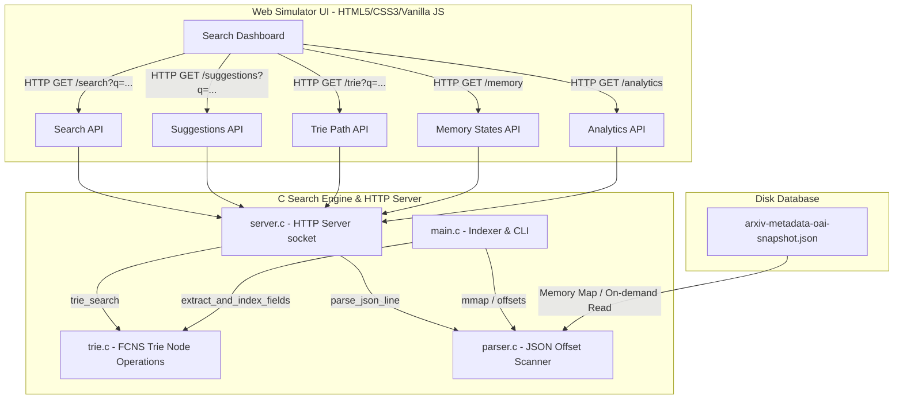

# Research Explorer: Visual Search Engine Internals Simulator

An interactive, high-performance visual simulator of a low-level Trie-based search engine. This project compiles and runs a backend HTTP server in pure C to index over **3 million scientific research papers** (~5 GB arXiv dataset) using a memory-optimized Trie data structure. It visualizes the internal mechanics—such as data flow pipelines, latency breakdowns, physical heap layouts, and active stack frames—on a retro-styled web interface.

---

## 🏗️ System Architecture

The project splits concerns between a highly-optimized C engine on the backend and a visual simulator dashboard in the frontend:



---

## 🧠 Core Data Structure: First-Child Next-Sibling (FCNS) Trie

A standard Trie node contains an array of child pointers for every alphabet character (e.g., `TrieNode* children[26]` or `children[256]`). This consumes **208 bytes** of pointer storage per node on a 64-bit system, which leads to massive memory bloat when indexing millions of words.

To solve this, this engine implements a **First-Child Next-Sibling (FCNS)** tree (a binary representation of a multiway tree). 

### Node Representation (`trie.h`)
```c
typedef struct TrieNode {
    char ch;                        // The character stored in the node
    bool is_word;                   // Flag indicating if this is the end of a valid word
    uint32_t address;               // Simulated memory heap address (e.g., 0x1000 + offset)
    
    struct TrieNode* first_child;   // Pointer to the first child node (downward edge)
    struct TrieNode* next_sibling;  // Pointer to the next sibling node (horizontal list)
    
    int* paper_indices;             // Dynamic array of matching document IDs (Postings List)
    int paper_count;                // Current count of document IDs in the postings list
    int paper_capacity;             // Allocated capacity of the postings list
} TrieNode;
```

### Visualizing FCNS Child Traversal
Instead of a wide array of pointers, siblings are chained sequentially. Finding a character involves traversing the `first_child` and following its `next_sibling` links:

```text
       (ROOT)
         | [first_child]
        ( 'c' ) ---> ( 'd' ) ---> ( 's' )  <-- next_sibling list
         | [first_child]
        ( 'a' )
         | [first_child]
        ( 't' ) <-- is_word = true (Postings: [102, 594, 1205])
```

* **Pros**: Node size drops to a fraction of standard representation (~40 bytes vs 240+ bytes).
* **Cons**: Sibling lookup increases from $O(1)$ to $O(k)$ where $k \le 26$. However, $k$ is extremely small for typical english character sets, resulting in negligible latency trade-offs.

---

## 🛠️ Detailed Walkthrough of C Code Components

### 1. Indexing & Memory Mapping ([main.c](file:///Users/jeevan/Desktop/DSA_Project/main.c))
* **Fast I/O with `mmap`**: The 4.96 GB JSON dataset is memory-mapped (`PROT_READ`, `MAP_SHARED`). This maps the file into the virtual address space of the process, letting the OS manage page swapping, which is significantly faster than standard `fread` loop calls.
* **Offset Table Scanning**: On boot, the program scans the file to locate newline characters, storing byte offset indices (`g_line_offsets`) for each paper. This allows instant $O(1)$ random access to the raw JSON of any document ID on disk.
* **Stopwords Filtering**: Words matching common conjunctions/prepositions (e.g., *the, and, of*) are filtered out using `is_stop_word()` in [trie.c](file:///Users/jeevan/Desktop/DSA_Project/trie.c) to prevent index inflation.

### 2. Multi-threaded / Single-threaded TCP Server ([server.c](file:///Users/jeevan/Desktop/DSA_Project/server.c))
* Hosts a lightweight, raw HTTP socket server listening on port `8080`.
* Handles CORS requests using options header handshake responses (`Access-Control-Allow-Origin: *`).
* Exposes JSON endpoints:
  * `/search?q=query&field=all&sort=date&page=1`: Executes prefix search and returns matched papers.
  * `/suggestions?q=word`: Returns auto-complete candidate words.
  * `/trie?q=word`: Details node pointers, siblings, and parent addresses to feed the SVG tree visualization.
  * `/memory`: Serializes simulated heap frames and call stack snapshots.
  * `/analytics`: Aggregates trends gathered during the initial indexing pass.

### 3. Parser ([parser.c](file:///Users/jeevan/Desktop/DSA_Project/parser.c))
* Extracts JSON values (such as `title`, `authors`, `categories`, and `abstract`) manually using fast string pointers (`strstr`), bypassing heavy JSON libraries.

---

## 🖥️ UI Component Documentation & Interactive Layouts

Here is an architectural map and explanation of each visual element on the dashboard:

```text
+---------------------------------------------------------------------------------------+
|  LOGO: Research Explorer | Mapped: 3,066,190 Papers | Nodes: 4.4M | Heap: 135 MB     | [1] Stats
+---------------------------------------------------------------------------------------+
| [ Search input: quantum neural              ] (Search) (Step Search) (Clear)          | [2] Search Bar
|  Filter: [X] All  [ ] Title  [ ] Authors   Sort: [Relevance                      ]    |
+---------------------------------------------------------------------------------------+
| +-----------------------------------------+ +---------------------------------------+ |
| | [3] Search Results                      | | [4] Trie Visualization Engine       | |
| | Found 8,421 papers in 1.2 ms            | |       (ROOT)                        | |
| |                                         | |        /   \                        | |
| | 1. Quantum Neural Networks [Score: 130] | |      'q'   'n'                      | |
| |    ID: 0802.1092 | cs.NE, quant-ph      | |      /       \                      | |
| |    Abstract: This paper proposes...     | |    'u'       'e'                    | |
| |                                         | |                                     | |
| | 2. ...                                  | | [5] Latency Timing Breakdown        | |
| |                                         | | Parse:  == [32 μs]                  | |
| |                                         | | Walk:   ==== [80 μs]                | |
| |                                         | | Fetch:  ========== [450 μs]         | |
| |                                         | | Sort:   ==== [110 μs]               | |
| +-----------------------------------------+ +---------------------------------------+ |
| +-----------------------------------------+ +---------------------------------------+ |
| | [6] Memory Visualizer (Heap & Stack)     | | [7] Data Flow & Postings            | |
| | Call Stack:                             | |  Query -> Trie Walk -> Postings     | |
| |   handle_search_endpoint()              | |  Active IDs: [102, 594, 1205]       | |
| |   trie_search(curr=0x2E4A)              | |                                     | |
| | Heap allocations:                       | | [8] Dataset Processing Pipeline     | |
| |   [0x1020: 'q'] -> [0x1040: 'u']        | |  arxiv.json -> Scanned -> Indexed   | |
| +-----------------------------------------+ +---------------------------------------+ |
+---------------------------------------------------------------------------------------+
```

### [1] Top Statistics Bar
* **What it shows**: Metrics gathered directly from the compiled database state.
* **C Interaction**: Fetches data from `/dataset` endpoint, exposing `g_line_count`, `total_nodes_allocated`, and simulated heap address values calculated in [main.c](file:///Users/jeevan/Desktop/DSA_Project/main.c).

### [2] Search & Filter Options
* **What it shows**: Text inputs, autocomplete suggestions dropdowns, and field filtering radio inputs.
* **C Interaction**: Triggers autocomplete queries to `/suggestions` on input keyup and executes search filters (e.g. searching authors only) at the C parser level.

### [3] Search Results & Relevance Scoring
* **What it shows**: List of papers paginated (10 results per page). Each item displays a hoverable `Score` badge showing relevance score weighting (Title match +100 pts, Author match +30 pts, Category match +10 pts).
* **C Interaction**: Backend handles retrieval and pagination limits, while `index.js` calculates and renders the scoring breakdown tooltip dynamically.

### [4] Trie Visualization Engine
* **What it shows**: An interactive SVG rendering showing the active search path traversal. Highlighted nodes indicate characters matched along the path, while sibling branches represent alternatives evaluated.
* **C Interaction**: Renders nodes returned from `/trie?q=word`, listing physical hex memory pointers, node labels, and is-word flags.

### [5] Latency Timing Breakdown
* **What it shows**: Color-coded bar charts detailing microsecond timings ($\mu s$) of four major search phases.
* **C Interaction**: The backend uses `gettimeofday()` timing intervals around input parsing, Trie walk, record fetching, and qsort sorting, returning exact microseconds to the client.

### [6] Memory Visualizer (Heap / Stack Trace)
* **What it shows**: 
  * **Simulated Call Stack**: A live table tracing the active execution path (e.g. `handle_search_endpoint() -> trie_search() -> intersect_postings()`) with parameters and local variables.
  * **Trie Node Heap Allocations**: Visualizes 32-byte aligned hex address block paths (e.g. `0x1000 -> 0x1020 -> 0x1040`) for nodes visited during lookup.
* **C Interaction**: Fed by the `/memory` endpoint, which maps `g_stack` frames pushed/popped during traversals, and tracks pointers mapped during `trie_search()`.

### [7] Search Engine Internals Data Flow
* **What it shows**: Flowchart mapping how packets travel from input query $\rightarrow$ Trie walk $\rightarrow$ Postings array retrieval $\rightarrow$ metadata disk read $\rightarrow$ response. Includes an active visual postings preview panel.
* **C Interaction**: Receives the array preview from `postings_preview` in `/search` responses.

---

## 🚀 Compiling and Running Locally

To build the index and run the HTTP server:

```bash
# 1. Compile the C backend binary
make

# 2. Start the search engine server
./research_explorer
```

Once the dataset offsets are mapped and the Trie is fully constructed, the server will bind to port `8080`. Open **[http://127.0.0.1:8080](http://127.0.0.1:8080)** in your browser to interact with the dashboard!
# Trie-Library
